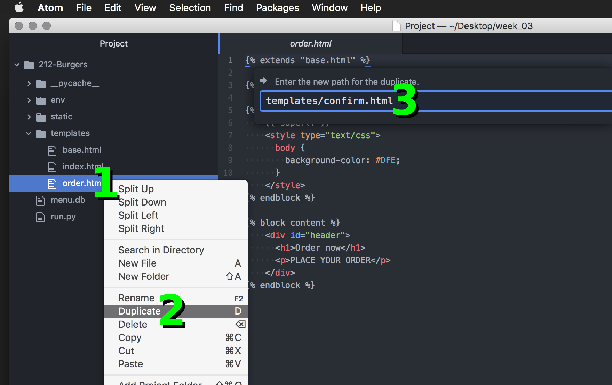
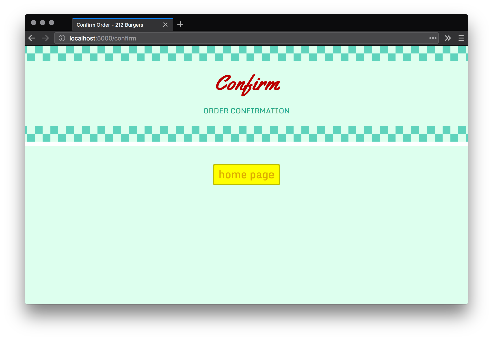
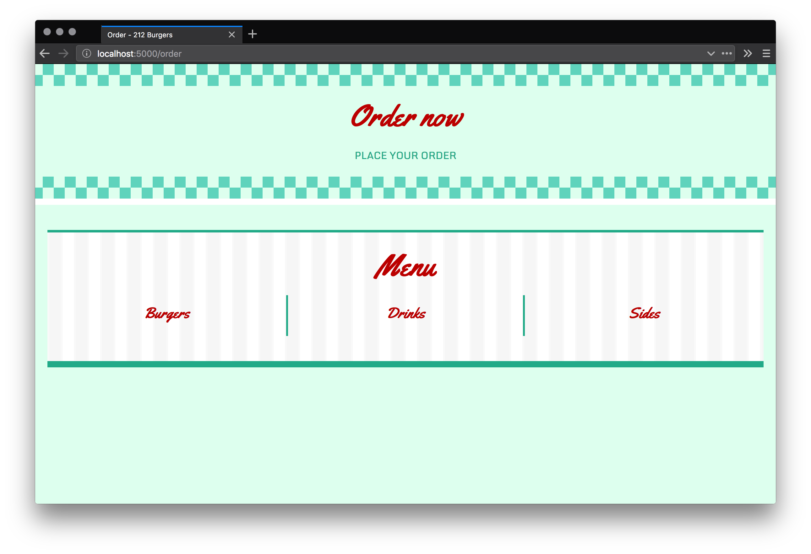
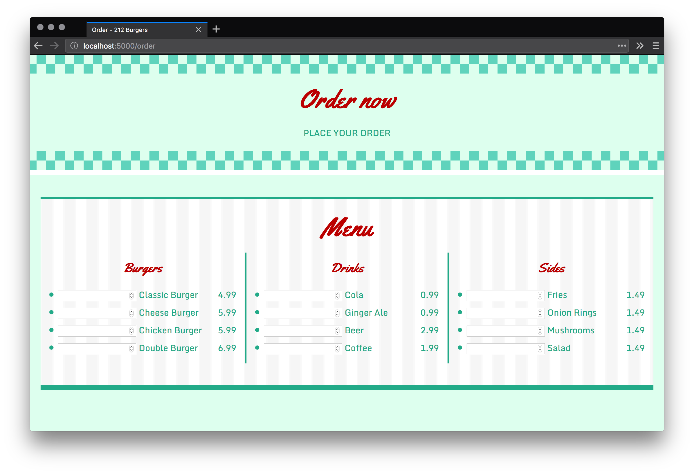
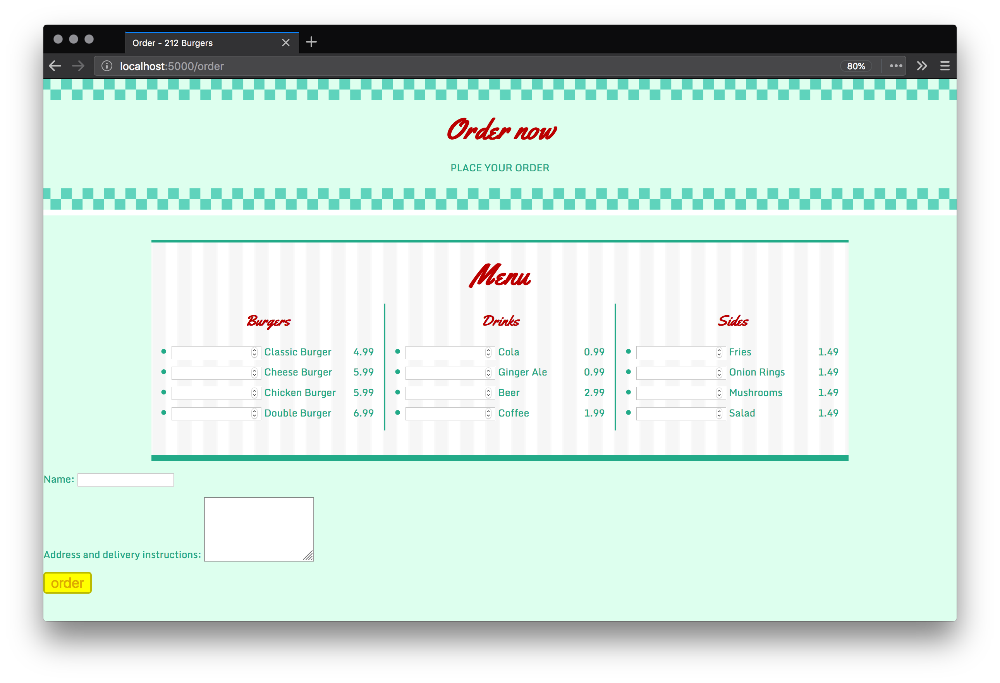
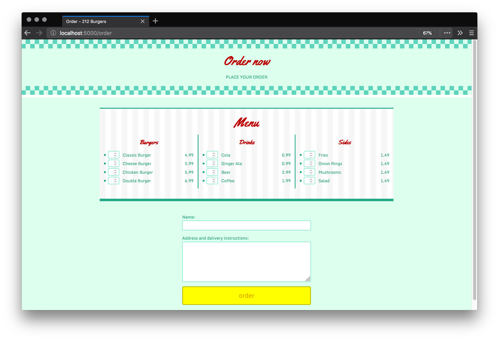
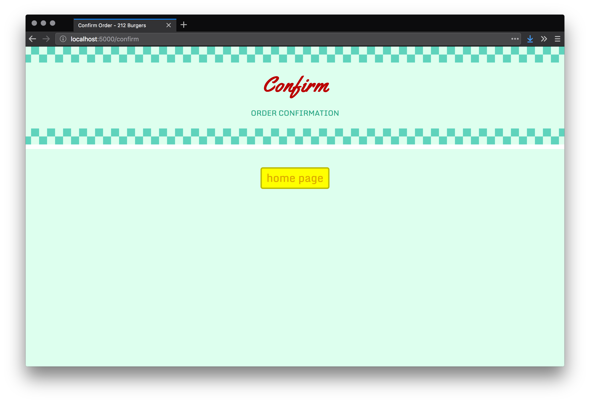
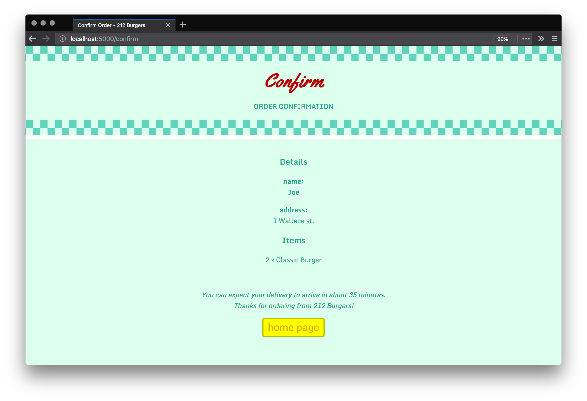

HTML Forms
==========

Forms allow one to capture information, which can then be entered into a database or used for other proposes. For this website, users will order burgers, drinks, and sides -- as well provide their names and delivery addresses using HTML forms.

Before creating an order form, you'll need to add an order confirmation page.

Creating a Confirmation Page
----------------------------

Duplicate the *order.html* template file and name it *confirm.html*. If you are using Atom, this can be accomplished by:

1. right-clicking on the *order.html* file in the Project panel;
2. selecting *Duplicate*;
3. and then entering the file name (confirm.html).



You'll also need to edit the *confirm.html* file. Change the `title`, `h1`, and `p` content, and add a `<div class="center-text">` element:

*confirm.html*
```html


Confirm Order - 212 Burgers

...



    <div id="header">
      <h1>Confirm</h1>
      <p>ORDER CONFIRMATION</p>
    </div>

    <div class="center-text">
      <p>
        <a class="btn-yellow" href="/">home page</a>
      </p>
    </div>


```

As you can tell from the `href` attribute, the button links back to the landing page. To center it, add a corresponding CSS rule to your *static/screen.css* file:

```css
...

.center-text {
  text-align: center;
}

...
```

You can now add the route for the confirm page:

*run.py*
```py
...

@app.route('/confirm')
def confirm():
    return render_template('confirm.html')
```

Open your browser and load the confirm page:  
http://localhost:5000/confirm



**Note** that you might have to disable your browser cache to load the latest CSS changes (to center the button). You can do this via the Chrome/Firefox developer tools; under the *Network* tab, there should be a checkbox labelled "Disable Cache" or similar.

It's not much to look at now, but this page will soon list the customer's order details.

Creating an Order Form
----------------------

Open the *order.html* template in your editor (Atom?). Add the menu code beneath the PLACE YOUR ORDER paragraph. This is, essentially, the same menu from the landing page with some `input` fields added:

*order.html*
```html
...



    <div id="header">
      <h1>Order now</h1>
      <p>PLACE YOUR ORDER</p>
    </div>

    <form action="/confirm" method="post">

      <div id="menu">

        <h1>Menu</h1>

        <div>
          <h2>Burgers</h2>
          <ul class="menu-items">
            
            <li>
              <input type="number" min="0" name="{{ burger[0] }}" autocomplete="off" />
              {{ burger[0] }}
              <span class="price">{{ burger[1] }}</span>
            </li>
            
          </ul>
        </div>

        <div>
          <h2>Drinks</h2>
          <ul class="menu-items">
            
            <li><input type="number" min="0" name="{{ drink[0] }}" autocomplete="off" />
            {{ drink[0] }}
            <span class="price">{{ drink[1] }}</span></li>
            
          </ul>
        </div>

        <div>
          <h2>Sides</h2>
          <ul class="menu-items">
            
            <li><input type="number" min="0" name="{{ side[0] }}" autocomplete="off" />
            {{ side[0] }}
            <span class="price">{{ side[1] }}</span></li>
            
          </ul>
        </div>

      </div>

    </form>


```

The `type` attribute for each field is equal to `number`; this is for numeric input (as opposed to letters and other characters).

Save, then open your browser and load the order page:  
http://localhost:5000/order



The lists are empty because no menu data is provided for the template variables (`burgers`, `drinks`, `sides`). To fix this, edit the `order()` function in *run.py*.

*run.py*
```py
...

@app.route('/order')
def order():
    con = sqlite3.connect(MENUDB)

    burgers = []
    free = '0'
    cur = con.execute('SELECT burger,price FROM burgers WHERE price>=?', (free,))
    for row in cur:
        burgers.append(list(row))

    drinks = []
    cur = con.execute('SELECT drink,price FROM drinks')
    for row in cur:
        drinks.append(list(row))

    sides = []
    cur = con.execute('SELECT side,price FROM sides')
    for row in cur:
        sides.append(list(row))

    con.close()

    return render_template('order.html', burgers=burgers, drinks=drinks, sides=sides)

@app.route('/confirm')
...
```

You'll notice, however, that this is an exact duplicate of the `index()` route's query. To avoid having the same code appear twice in the *run.py* file, define a new function, `fetchMenu()` to handle those lines; then edit the `index()` and `order()` functions accordingly:

*run.py*
```py
...

MENUDB = 'menu.db'

def fetchMenu(con):
    burgers = []
    free = '0'
    cur = con.execute('SELECT burger,price FROM burgers WHERE price>=?', (free,))
    for row in cur:
        burgers.append(list(row))

    drinks = []
    cur = con.execute('SELECT drink,price FROM drinks')
    for row in cur:
        drinks.append(list(row))

    sides = []
    cur = con.execute('SELECT side,price FROM sides')
    for row in cur:
        sides.append(list(row))

    return {'burgers':burgers, 'drinks':drinks, 'sides':sides}

@app.route('/')
def index():
    con = sqlite3.connect(MENUDB)
    menu = fetchMenu(con)
    con.close()
    return render_template(
        'index.html',
        disclaimer='may contain traces of nuts',  
        burgers=menu['burgers'],
        drinks=menu['drinks'],
        sides=menu['sides']
    )

@app.route('/order')
def order():
    con = sqlite3.connect(MENUDB)
    menu = fetchMenu(con)
    con.close()
    return render_template('order.html', burgers=menu['burgers'], drinks=menu['drinks'], sides=menu['sides'])

...
```

Save, then refresh the order page:



The user can specify how many of each item to order. You'll also need the customer's name and address, so add the following order-details code to your form (just before the closing `form` tag):

*order.html*
```html
      ...

      <div id="order-details">
        <p>
          <label for="name">Name:</label>
          <input type="text" id="name" name="name" required />
        </p>
        <p>
          <label for="address">Address and delivery instructions:</label>
          <textarea id="address" name="address" rows="6" required></textarea>
        </p>
        <input type="submit" value="order" class="btn-yellow" />
      </div>

    </form>


```

Save, then refresh the order page:



**Note** that I've zoomed-out a bit to fit everything within the browser window.

You have all of the input fields you require, but these could do with some styling. Open your style-sheet and add the following rules:

*screen.css*
```css
...

/* forms */

input, textarea {
  border: solid 2px #5DB;
  border-radius: 3px;
  color: #2A8;
  font-family: 'Monda', sans-serif;
  font-size: 0.8em;
  height: 2em;
  padding: 0 0.5em;
}

textarea {
  height: auto;
  width: 100%;
}

#menu input, #menu textarea {
  float: left;
  margin-right: 1em;
  margin-top: -0.15em;
  width: 2.2em;
}

#order-details {
  margin: auto;
  max-width: 500px;
  padding: 2em 2.5em;
}

#order-details input,
#order-details textarea {
  box-sizing: border-box;
  min-height: 3em;
  width: 100%;
}

...
```

Save, then refresh the order page:



There'll be some up/down arrows alongside each number input. To hide those arrows, use this CSS:

```css
/* firefox */
input[type="number"] {
  -moz-appearance: textfield;
}
/* chrome, safari, edge, opera */
input::-webkit-outer-spin-button,
input::-webkit-inner-spin-button {
  -webkit-appearance: none;
  margin: 0;
}
```

In addition to the built-in browser validation, you could add some JavaScript validation -- then further validate the input using Python -- but, to keep things simple, this tutorial will not cover such techniques.


Submitting Form Data to Flask
=============================

In the *order.html* file, take note of the `action` and `method` attributes in the opening form tag:

```html
<form action="/confirm" method="post">
```

The `method` can either be `get` or `post`. `get` passes all of the form data across the address bar; for example, one can search Google for "dog" using the following URL:

https://www.google.com/search?q=dog

This is because the Google search form uses `get`.

The `post` method conceals this information, which makes it better suited for submitting sensitive form data (although, further steps should be taken to secure things correctly). We'll use `post` in this instance.

Because you'll be submitting form data to the `confirm` route, you must configure it to accept `post` requests -- this entails importing Flask's `request`, and adding a `methods=['POST']` argument to the relevant route line:

*run.py*
```py
from flask import Flask, render_template, request

...

@app.route('/confirm', methods=['POST'])
def confirm():
    print(request.form)
    return render_template('confirm.html')
```

The `print(request.form)` line will print whatever Flask captures to the Terminal. You can test this out by placing an order using the order form (and clicking "order" button). In this example, Joe of 1 Wallace street has ordered 2 Classic Burgers:


The problem is that the confirm page remains is blank:



Amend your confirm function:

*run.py*
```py
@app.route('/confirm', methods=['POST'])
def confirm():
    details = {}
    items = {}

    for input in request.form:
        if input == 'name' or input == 'address':
            details[input] = request.form[input]
        elif request.form[input] and request.form[input] != '0':
            items[input] = request.form[input]

    return render_template('confirm.html', details=details, items=items)
```

The `for` loop above prunes the data, omitting any zero or empty values. The refined `details` and `items` dictionaries (or, *associative arrays* in JS-speak) are passed to the template. To render them, add some *Details* and *Items* code to your confirm template:

*confirm.html*
```html
...

<div class="center-text">

  <div>
    <h3>Details</h3>
    
    <p><strong>{{ key }}:</strong><br />{{ details[key] }}</p>
    
  </div>

  <div>
    <h3>Items</h3>
    
    {{ items[item] }} &times; {{ item }}<br />
    
  </div>

  <p>&nbsp;</p>
  <p>
    <em>You can expect your delivery to arrive in about 35 minutes. <br />Thanks for ordering from 212 Burgers!</em>
  </p>
  <p>
    <a class="btn-yellow" href="/">home page</a>
  </p>

</div>


```

Save, then refresh the confirm page. Refreshing will resubmit the data, which saves you having to re-fill-out the order form.



Entering Orders Data into the Database
--------------------------------------

Open your database (in a new Terminal window) using `sqlite3 menu.db`. Create a new table:

```
CREATE TABLE orders(
  id INTEGER PRIMARY KEY,
  name TEXT,
  address TEXT,
  items TEXT
);
```


Now amend your confirm code, adding the (four) lines for connecting to the database and inserting the data:

*run.py*
```py
@app.route('/confirm', methods=['POST'])
def confirm():
    details = {}
    items = {}

    for input in request.form:
        if input == 'name' or input == 'address':
            details[input] = request.form[input]
        elif request.form[input] and request.form[input] != '0':
            items[input] = request.form[input]

    con = sqlite3.connect(MENUDB)
    cur = con.execute(
      'INSERT INTO orders(name, address, items) VALUES(?, ?, ?)',
      (details['name'], details['address'], str(items))
    )
    con.commit()
    con.close()

    return render_template('confirm.html', details=details, items=items)
```

The `(?, ?, ?)` part -- split across two lines to make it more legible -- is substituted by the variables in brackets that follow it. This will prevent SQL injection attacks. The `con.commit()` is necessary because you are performing a change to the database. The `str()` function converts the dictionary to a string.

Refresh the confirm page. You can verify that your data is entered in the SQLite database by running:

```
SELECT * FROM orders;
```

*end*
